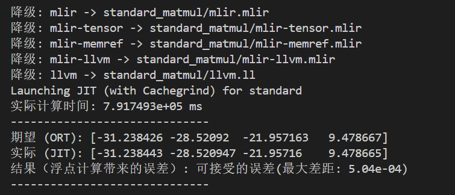

# Tensor-Compiler
基于 MLIR 框架实现自定义**TAC 张量方言**（Tensor Accelerator Compiler），支持部分 ONNX 算子（Constant、Add、ReLU、MatMul），实现了从 ONNX 计算图->自定义TAC方言->MLIR标准方言->LLVM IR 的逐层降级流水线，并通过 JIT 编译执行。

测试：矩阵乘法A[2048,2048] x B[2048,2048] = C[2048,2048]\
优化策略：矩阵转置(B[K,N] -> B_T[N,K]) vs. 维度交换([M,N,K]->[M,K,N]) vs. 矩阵转置+循环分块 vs. 维度交换+循环分块\
测试结果分析：用Valgrind Cachegrind工具量化分析缓存效率
| 指标 | 无优化 | 转置 | 维度交换 | 转置+分块 | 维度交换+分块 |
| --- | --- | --- | --- | --- | --- |
| 运行时间(未开启valgrind) | 27.3s | 9.34s | 7.16s | 11.2s | 10.1s |
| 执行指令数 | 69.17B | 69.21B | 69.18B | 70.27B | 70.42B |
| L1指令缓存读缺失 | 2.58M | 2.92M | 2.63M | 2.57M | 3.38M |
| L2指令缓存读缺失 | 0.19M | 0.20M | 0.20M | 0.19M | 0.21M |
| 内存读总次数 | 17.32B | 17.33B | **25.91B** | 17.46B | **25.92B** | 
| L1数据缓存读缺失 | 8.61B | 0.56B | 0.55B | 0.58B | 0.71B |
| L2数据缓存读缺失 | 8.60B | 0.54B | 0.54B | **0.0135B** | **0.0093B** |
| 内存数据写次数 | 8.65B | 8.65B | 8.65B | 8.65B | 8.65B |
| L1数据缓存写缺失 | 1.21M | 1.50M | 1.22M | 1.48M | 1.29M |
| L2数据缓存写缺失 | 0.89M | 1.15M | 0.89M | 1.15M | 0.89M |

可以发现[维度交换]会导致内存读总次数增加，主要原因是MNK->MKN后, 每次计算C[M,N]位置都在变化，破坏了C[M,N]的寄存器复用，每次循环迭代都需要读C[M,N]，内存读次数增加2048^3\
[维度交换]相比[转置]更快，因为多出来的读指令C[M,N]都是L1命中，延迟极低，最内层依赖链更短，指令级并行（ILP）翻倍，**迭代之间没有循环携带依赖**。CPU 可以同时发射多条乘加指令，利用多个浮点执行单元并行计算，浮点吞吐量显著提升。\
比较反常的是[分块]降低了效率，可以发现虽然L2数据缓存读缺失次数减少10多倍，但是分块带来的「循环控制开销、内层向量化损失、地址计算开销」总和，超过了「内存延迟减少」带来的收益，所以整体时间反而上升。短循环破坏了编译器向量化，x86 内存延迟低，内存收益权重小

- [Tensor-Compiler](#tensor-compiler)
  - [1.环境配置](#1环境配置)
    - [1.1 MLIR库安装](#11-mlir库安装)
    - [1.2 配置clangd插件](#12-配置clangd插件)
    - [1.3 主体目录环境](#13-主体目录环境)
  - [2. tac方言](#2-tac方言)
    - [2.1 tac方言定义](#21-tac方言定义)
    - [2.2 tac\_op定义](#22-tac_op定义)
    - [2.3 tac方言实现](#23-tac方言实现)
    - [2.4 tac-opt工具](#24-tac-opt工具)
    - [2.5 tac方言测试](#25-tac方言测试)
  - [3. ONNX模型计算图解析为TAC方言](#3-onnx模型计算图解析为tac方言)
    - [3.1 C++ Protobuf库](#31-c-protobuf库)
    - [3.2 自定义ONNX模型解析](#32-自定义onnx模型解析)
    - [3.3 ONNX模型解析测试](#33-onnx模型解析测试)
    - [3.4 ONNX模型转TAC方言](#34-onnx模型转tac方言)
    - [3.5 ONNX模型转TAC方言测试](#35-onnx模型转tac方言测试)
  - [4.tac方言降级](#4tac方言降级)
    - [4.1 tac方言转Tensor\_Linalg](#41-tac方言转tensor_linalg)
    - [4.2 降级流水线](#42-降级流水线)
    - [4.3 测试及验证](#43-测试及验证)
  - [5. Pass设计优化IR](#5-pass设计优化ir)
    - [5.1 矩阵转置](#51-矩阵转置)
    - [5.2 维度交换](#52-维度交换)
    - [5.3 矩阵分块](#53-矩阵分块)
    - [5.4 测试及缓存分析](#54-测试及缓存分析)


## 1.<a name='环境配置'></a>环境配置
### 1.1 <a name='MLIR库安装'></a>MLIR库安装
平台：Ubuntu 22.04.5 LTS \
mlir项目工程模版：
```
mlir-onnx
├── install             # Install Prefix，把 MLIR 编译后安装到这里
├── llvm-project        # MLIR 项目
└── tensor-compiler     # 自己的 MLIR 工程
```
首先，按照 MLIR [getting started](https://mlir.llvm.org/getting_started/) 的方法，安装 MLIR。
注意，安装的时候要设置 PREFIX 为 install 目录，如下面所示，和 getting start 上的略有区别：
```bash
# 使用当前MLIR稳定分支版本 22.1.8，只拉取对应标签的代码，国内镜像更快
# 4核8G编译时经常内存爆掉，使用单核编译以及lld链接器,编译目标：Native;NVPTX;AMDGPU（只选Native更快)
# 也可以改成动态库，静态库编译很慢
git clone --depth 1 --branch llvmorg-22.1.8 https://mirrors.bfsu.edu.cn/git/llvm-project.git
cd llvm-project
mkdir build && cd build

apt install lld
cmake -G Ninja ../llvm \
  -DCMAKE_INSTALL_PREFIX=/home/ubuntu//mlir-onnx/install \
  -DLLVM_ENABLE_PROJECTS=mlir \
  -DLLVM_BUILD_EXAMPLES=ON \
  -DLLVM_TARGETS_TO_BUILD="Native" \
  -DCMAKE_BUILD_TYPE=Release \
  -DLLVM_ENABLE_ASSERTIONS=ON \
  -DLLVM_USE_LINKER=lld
```
在build完成之后，安装到prefix，耗时比较长，而且占用内存非常大
```bash
ninja -j1 install
nohup ninja -j1 install > install.log 2>&1 & # 后台安装，2核
```
现在 mlir 把所有二进制文件、库文件都装到了 install 目录下。
可以通过 `export PATH=/mlir-onnx/install/bin:$PATH` 将 MLIR 工具链加入环境变量，直接调用 `mlir-opt` `mlir-translate` 等二进制程序。
若需要永久生效，可把该环境变量配置追加到 `~/.bashrc` 文件末尾，执行 `source ~/.bashrc` 加载配置。
```bash
echo 'export PATH=/home/ubuntu/mlir-onnx/install/bin:$PATH' >> ~/.bashrc
source ~/.bashrc
```
验证:
```bash
which mlir-opt
```

### 1.2 <a name='配置clangd插件'></a>配置clangd插件
有时候，mlir 的编译选项与 clangd 冲突，在 tensor-compiler 目录下建立 .clangd 文件，去掉相关的选项：
```
CompileFlags:
  Remove:
    - -fno-lifetime-dse
```

### 1.3 <a name='主体目录环境'></a>主体目录环境
```
├── build                   # 编译文件夹 
├── include                 
│   ├── onnx                # protobuf库文件，解析ONNX需要
│   └── tac                 # tac方言的头文件
├── lib
│   ├── dialect_tac         # tac方言定义的td文件和实现cpp
│   ├── parser_onnx         # ONNX文件解析转换为tac方言
│   └── pass_tac            # tac方言的转换和优化pass的td文件和实现
├── tac_test                # 测试文件夹
├── tools                   # tac-opt实现，方便测试
├── README.md
└── LICENSE
```

## 2. <a name='tac方言'></a>tac方言
### 2.1 <a name='tac方言定义'></a>tac方言定义
在 lib/dialect_tac 文件夹创建 TacDialect.td \
在 include/tac 文件夹创建 TacDialect.h \
其中 TacDialect.h.inc 为mlir按照TacDialect.td自动生成的文件
```mlir
// ============TacDialect.td============
#ifndef TAC_DIALECT_TD
#define TAC_DIALECT_TD

include "mlir/IR/DialectBase.td"
def TacDialect : Dialect{
    let name = "tac";
    let cppNamespace = "tac";
    let summary = "Tac dialect - by bei meng";
}
#endif

// ============TacDialect.h============
#pragma once
# include "mlir/IR/Dialect.h"
# include "mlir/IR/BuiltinDialect.h"
# include "TacDialect.h.inc"

```

### 2.2 <a name='tac_op定义'></a>tac_op定义
在 lib/dialect_tac 文件夹创建 TacOps.td \
在 include/tac 文件夹创建 TacOps.h \
这里创建了一个constant的op，用于将字面值转换为一个SSA值，数据作为属性挂载在算子上。 \
AddOp、ReluOp、MatMulOp见完整文件内容 \
注意事项：td里面include的td头文件，在h文件里面也有导入对应的h文件
```mlir
// ============TacOps.td============
#ifndef TAC_OPS_TD
#define TAC_OPS_TD

include "mlir/IR/OpBase.td"
include "mlir/Interfaces/SideEffectInterfaces.td"
include "mlir/Interfaces/InferTypeOpInterface.td"
include "TacDialect.td"

class TacOp<string mnemonic,list<Trait> traits = []>:
    Op<TacDialect,mnemonic,traits>;

def ConstantOp : TacOp<"constant",[Pure]>{
    let summary = "constant";
    let description = [{
        常量算子将字面值转换为一个SSA值，数据作为属性挂载在算子上。
    }];
    let arguments = (ins ElementsAttr:$value);
    let results = (outs F32Tensor:$result);
    let hasVerifier = true;
    let builders = [
        OpBuilder<(ins "::mlir::DenseElementsAttr":$value), [{
            build($_builder, $_state, value.getType(), value);
        }]>
    ];

    let assemblyFormat = "$value attr-dict `:` type($result)";
}
#endif

// ============TacOps.h============
#pragma once
// 基础IR
#include "mlir/IR/OpDefinition.h"
#include "mlir/IR/BuiltinOps.h"
#include "mlir/IR/Builders.h"
// td里include的
#include "mlir/Interfaces/SideEffectInterfaces.h"
#include "mlir/Interfaces/InferTypeOpInterface.h"

// td里面include,这里也要include对应的h文件
#include "TacDialect.h"         // 1. 先包含方言核心头文件（同目录下直接写文件名）
#define GET_OP_CLASSES          // 2. 控制宏：告诉.inc文件输出所有Op的完整类声明
#include "TacOps.h.inc"         // 3. TableGen生成的Op声明文件（构建目录下，通过搜索路径找到）
```

### 2.3 <a name='tac方言实现'></a>tac方言实现
在 lib/dialect_tac 文件夹创建 tac.cpp
```mlir
#include "tac/TacDialect.h"
#include "tac/TacOps.h"

// 对应具体实现
#define GET_DIALECT_DEFS
#include "TacDialect.cpp.inc"
#define GET_OP_CLASSES
#include "TacOps.cpp.inc"

using namespace tac;
using namespace mlir;
void TacDialect::initialize(){
    addOperations<
        #define GET_OP_LIST
        #include "TacOps.cpp.inc"
    >();
}

// 对应ConstantOp的hasVerifier= true
LogicalResult ConstantOp::verify() {
    auto tensorAttr = llvm::dyn_cast<DenseElementsAttr>(getValue());
    if (!tensorAttr) {return emitOpError("requires a dense elements attribute");}
    auto tensorType = llvm::cast<RankedTensorType>(getResult().getType());
    if (tensorAttr.getNumElements() != tensorType.getNumElements()) {
        return emitOpError() << "number of elements in 'value' attribute ("
                                << tensorAttr.getNumElements()
                                << ") does not match the result type ("
                                << tensorType.getNumElements() << ")";
    }
    return success();
}
```

### 2.4 <a name='tac-opt工具'></a>tac-opt工具
tac-opt工具能方便在命令行测试 \
在 tools 文件夹创建 tac-opt.cpp
```mlir
#include "mlir/IR/DialectRegistry.h"
#include "mlir/Tools/mlir-opt/MlirOptMain.h"
#include "mlir/Transforms/Passes.h"
#include "mlir/Dialect/Func/IR/FuncOps.h"
#include "tac/TacDialect.h"

using namespace mlir;
using namespace llvm;

int main(int argc,char **argv){
    DialectRegistry registry;
    // 注册dialect
    registry.insert<tac::TacDialect,func::FuncDialect>();
    // 注册pass
    registerCSEPass();
    registerCanonicalizerPass();
    return asMainReturnCode(MlirOptMain(argc,argv,"tac-opt",registry));
}
```

### 2.5 <a name='tac方言测试'></a>tac方言测试
在build目录下面使用ninja工具进行编译
```bash
cd build
cmake .. -GNinja
ninja
ninja tac-opt
```
创建一个constant.mlir文件，用于测试方言和算子是否正确注册
```mlir
// constant.mlir
func.func @test_const() -> tensor<2x3xf32> {
  %0 = "tac.constant"() {value = dense<[[1.0, 2.0, 3.0], [4.0, 5.0, 6.0]]> : tensor<2x3xf32>} : () -> tensor<2x3xf32>
  return %0 : tensor<2x3xf32>
}
```
build目录下使用tac-opt工具能正确读取和输出，说明方言和算子创建成功
```bash
./tac-opt constant.mlir

# 输出：
# module {
#   func.func @test_const() -> tensor<2x3xf32> {
#     %0 = tac.constant dense<[[1.000000e+00, 2.000000e+00, 3.000000e+00], [4.000000e+00, 5.000000e+00, 6.000000e+00]]> : tensor<2x3xf32> : tensor<2x3xf32>
#     return %0 : tensor<2x3xf32>
#   }
# }
```

## 3. <a name='ONNX模型计算图解析为TAC方言'></a>ONNX模型计算图解析为TAC方言
只做结构读取和信息提取，不涉及运行时\
ONNX模型文件 → 前端解析 → 中间表示优化/降级
### 3.1 <a name='C++_Protobuf库'></a>C++ Protobuf库
ONNX 模型文件本质是 Protobuf 序列化数据，C++ 读取、解析onnx文件，需要 C++ Protobuf 库。\
首先安装protoc(protobuf编译器)
```bash
sudo apt install protobuf-compiler libprotobuf-dev
protoc --version
```
会通过Python来生成ONNX模型，所以Python的onnx版本要对齐
```bash
python3 -c "import onnx; print(onnx.__version__)"
# 输出：1.23.0
```
然后拉取对应版本的ONNX，编译生成ONNX模型解析需要的头文件：\
`onnx-ml.pb.h`：C++ 头文件，声明 `onnx::ModelProto`、`onnx::GraphProto`、`onnx::NodeProto` 等所有类 \
`onnx-ml.pb.cc`：C++ 源文件，protobuf 序列化 / 反序列化的实现代码 \
然后将对应的头文件和实现移动到项目中
```bash
git clone --depth 1 --branch rel-1.23.0 git@github.com:onnx/onnx.git
cd onnx
protoc --cpp_out=. onnx/onnx-ml.proto

mv onnx/onnx-ml.pb.h /home/ubuntu/mlir-onnx/tensor-compiler/include/onnx
mv onnx/onnx-ml.pb.cc /home/ubuntu/mlir-onnx/tensor-compiler/include/onnx
```

### 3.2 <a name='自定义ONNX模型解析'></a>自定义ONNX模型解析
项目是为了轻量化的实现ONNX算子到MLIR编译器的前端降级，不是做推理运行时，所以选择了自己做轻量解析。在解析阶段将constant提权合并到initializer，方便后续转换为MLIR。
首先构建onnx的proto对应的数据结构，用于存储解析的信息，然后利用Protobuf库将ModelProto解析为ModeInfo
```C++
// include/tac/OnnxModelInfo.h
// 存数据+形状+元素类型
struct TensorInfo;
// 存形状+元素类型
struct ValueInfo;
// 存属性，这里主要对应tensor类型的属性
struct AttributeInfo;
// 存算子节点，op_type，输入输出名称，还有属性
struct NodeInfo;
// 存图数据，Initializer，node，输入输出的Value
struct GraphInfo;
struct ModelInfo;

// lib/parser_onnx/OnnxParser.cpp 解析实现
// lib/parser_onnx/OnnxDumping.cpp 解析结果输出
```

### 3.3 <a name='ONNX模型解析测试'></a>ONNX模型解析测试
使用python的onnx库helper工具，自定义model生成对应的onnx文件，使用OnnxParser进行解析和OnnxDumping输出，目前仅支持Constant、MatMul、Relu、Add操作。
```bash
# onnxParseTest.cpp里面调用OnnxParser.cpp解析函数和OnnxDumping.cpp打印函数
# 先编译生成测试程序
cd build
ninja
# 再调用py程序生成对应的ONNX模型
bash ../generateOnnxModel.sh
# 进行测试
./onnx_parse_test ../tac_test/onnx_files/const_add.onnx

# 输出
# Model has 3 nodes
# ONNX Model
#   IR Version: 8
#   Producer: tac-compiler
#   Graph: ToyCompilerGraph
#   Initializers [2]
#     Name: const_out
#         Tensor Info
#         shape: [ 2 ]
#         dtype: float32
#         raw_bytes (hex): 00 00 80 3f 00 00 80 3f  (8 bytes)

#     Name: stem.1.weight
#         Tensor Info
#         shape: [ 2 ]
#         dtype: float32
#         raw_bytes (hex): 00 00 20 41 00 00 a0 41  (8 bytes)

#   Nodes: 2
#        Op: Add
#            Inputs: x stem.1.weight 
#            Outputs: sum1 
#        Op: Add
#            Inputs: sum1 const_out 
#            Outputs: final_out 
# Graph inputs: 
#    Value: x
#        shape: [2]
# Graph outputs: 
#    Value: final_out
#        shape: [2]
```

### 3.4 <a name='ONNX模型转TAC方言'></a>ONNX模型转TAC方言
在转换ONNX解析得到的model转换为MLIR时，要确保model的graph的nodes是拓扑有序的 \
转换核心是将ONNX的基于字符串的数据流映射为MLIR基于Value的数据流，主要步骤如下
```C++
// lib/parser_onnx/OnnxModelToMlir.cpp
// mlir::OwningOpRef<mlir::ModuleOp> onnxModelToMlir(mlir::MLIRContext &context,ModelInfo &model)

// 先构建一个mlir::Func::FuncOp用于将自定义的onnx模型包裹，便于后续的jit执行
// 其中argTypes由graph的inputs信息生成
llvm::SmallVector<mlir::Type, 4> argTypes;
for(const auto &inputInfo :model.graph.inputs){
    auto elementType = getMlirType(builder, inputInfo.elementType);
    argTypes.push_back(mlir::RankedTensorType::get(inputInfo.shape,elementType));
}

auto func = mlir::func::FuncOp::create(
    builder.getUnknownLoc(),"main",
    builder.getFunctionType(argTypes,{})
);

// 添加 llvm.emit_c_interface 属性，生成C兼容调用入口，
// 让外部C/C++程序能够直接调用该模型函数  
func->setAttr(mlir::LLVM::LLVMDialect::getEmitCWrapperAttrName(),
    builder.getUnitAttr());

// 用于映射ONNX基于字符串的数据流到MLIR基于Value的数据流
llvm::StringMap<mlir::Value> valueMap;

// graph输入映射到FuncOp的起始块参数
size_t n = model.graph.inputs.size();
for (size_t i = 0; i < n; ++i) {
    const auto &inputInfo = model.graph.inputs[i];
    valueMap[inputInfo.name] = entry->getArgument(i);
}

// 然后再按顺序遍历nodes，解析onnx的时候要确保得到的model的graph的nodes是拓扑有序的
if(!onnxNameToMlirValue(Ibuilder,model,valueMap)){
    return nullptr;
}

// 最后插入returnOp，处理返回值和FuncOp的返回类型
llvm::SmallVector<mlir::Value, 4> returnValues;
llvm::SmallVector<mlir::Type, 4> returnTypes;

for(const auto &outputInfo :model.graph.outputs){
    if(valueMap.count(outputInfo.name)){
        mlir::Value val = valueMap[outputInfo.name];
        returnValues.push_back(val);
        returnTypes.push_back(val.getType());
    }else{
        llvm::errs() << "Error: Graph output '" << outputInfo.name << "' not found!\n";
        return nullptr;
    }
}

Ibuilder.create<mlir::func::ReturnOp>(returnValues);
func.setType(builder.getFunctionType(argTypes, returnTypes));
```

### 3.5 <a name='ONNX模型转TAC方言测试'></a>ONNX模型转TAC方言测试
将解析Onnx模型得到model降级为mlir的tac方言，再进行输出
```bash
./onnx_parse_test ../tac_test/onnx_files/const_add_relu_matmul_2x1.onnx --mlir

# 输出结果
# module {
#   func.func @main(%arg0: tensor<2xf32>) -> tensor<1xf32> attributes {llvm.emit_c_interface} {
#     %0 = tac.constant dense<[-0.686011254, 0.589478493]> : tensor<2xf32> : tensor<2xf32>
#     %1 = "tac.add"(%arg0, %0) : (tensor<2xf32>, tensor<2xf32>) -> tensor<2xf32>
#     %2 = tac.constant dense<1.000000e+00> : tensor<2xf32> : tensor<2xf32>
#     %3 = "tac.add"(%1, %2) : (tensor<2xf32>, tensor<2xf32>) -> tensor<2xf32>
#     %4 = tac.relu %3 : tensor<2xf32>
#     %5 = tac.constant dense<[[1.04496622], [1.04839361]]> : tensor<2x1xf32> : tensor<2x1xf32>
#     %6 = "tac.matmul"(%4, %5) : (tensor<2xf32>, tensor<2x1xf32>) -> tensor<1xf32>
#     return %6 : tensor<1xf32>
#   }
# }


```


## 4.<a name='tac方言降级'></a>tac方言降级
TAC 方言 → MLIR 标准张量计算方言\
自定义算子接入 MLIR 官方编译生态：通过模式重写将 TAC 方言的高层算子对齐到标准张量计算栈，再经分层降级逐步降低抽象层级，最终转换为可执行的底层 IR。

### 4.1 <a name='tac方言转Tensor_Linalg'></a>tac方言转Tensor_Linalg
基于 MLIR 的`PatternRewriter`模式重写机制，将 TAC 方言算子逐一对齐到「Tensor + Arith + Linalg」官方标准方言，在完整保留计算语义的前提下，接入 MLIR 原生优化流水线。各算子映射规则如下：

| TAC 算子 | 目标标准算子 | 说明 |
| --- | --- | --- |
| `tac.constant` | `arith.constant` | 常量算子直接映射到算术方言常量，保留张量数值与类型，作为计算图的叶子节点 |
| `tac.add` | `linalg.add` | 逐元素加法映射到 Linalg 原生逐元素算子，由框架统一处理形状语义 |
| `tac.relu` | `linalg.generic` | 通过 `linalg.generic` 自定义仿射索引映射与计算逻辑，需手动处理 AffineMap|
| `tac.matmul` | `linalg.matmul/linalg.generic` | 矩阵乘算子直接映射到 Linalg 原生矩阵乘算子 或者进行转置和维度交换优化转换为linalg.generic|

可以通过tac-opt工具观察转换结果
```bash
# constant.mlir文件内容
# func.func @test_all_ops() -> tensor<2x2xf32> {
#   %c1 = "tac.constant"() {value = dense<[[1.0, 2.0, 3.0], [4.0, 5.0, 6.0]]> : tensor<2x3xf32>} : () -> tensor<2x3xf32>
#   %c2 = "tac.constant"() {value = dense<[[0.5, 1.0, 1.5], [2.0, 2.5, 3.0]]> : tensor<2x3xf32>} : () -> tensor<2x3xf32>
#   %add = "tac.add"(%c1, %c2) : (tensor<2x3xf32>, tensor<2x3xf32>) -> tensor<2x3xf32>
#   %relu = "tac.relu"(%add) : (tensor<2x3xf32>) -> tensor<2x3xf32>
#   %c3 = "tac.constant"() {value = dense<[[1.0, 0.0], [0.0, 1.0], [1.0, 1.0]]> : tensor<3x2xf32>} : () -> tensor<3x2xf32>
#   %matmul = "tac.matmul"(%relu, %c3) : (tensor<2x3xf32>, tensor<3x2xf32>) -> tensor<2x2xf32>
#   return %matmul : tensor<2x2xf32>
# }

./tac-opt --LowerToTensor ../tac_test/mlir/constant.mlir

输出
# module {
#   func.func @test_all_ops() -> tensor<2x2xf32> {
#     %cst = arith.constant dense<[[1.000000e+00, 2.000000e+00, 3.000000e+00], [4.000000e+00, 5.000000e+00, 6.000000e+00]]> : tensor<2x3xf32>
#     %cst_0 = arith.constant dense<[[5.000000e-01, 1.000000e+00, 1.500000e+00], [2.000000e+00, 2.500000e+00, 3.000000e+00]]> : tensor<2x3xf32>
#     %0 = tensor.empty() : tensor<2x3xf32>
#     %1 = linalg.add ins(%cst, %cst_0 : tensor<2x3xf32>, tensor<2x3xf32>) outs(%0 : tensor<2x3xf32>) -> tensor<2x3xf32>
#     %cst_1 = arith.constant 0.000000e+00 : f32
#     %2 = tensor.empty() : tensor<2x3xf32>
#     %3 = linalg.max ins(%1, %cst_1 : tensor<2x3xf32>, f32) outs(%2 : tensor<2x3xf32>) -> tensor<2x3xf32>
#     %cst_2 = arith.constant dense<[[1.000000e+00, 0.000000e+00], [0.000000e+00, 1.000000e+00], [1.000000e+00, 1.000000e+00]]> : tensor<3x2xf32>
#     %4 = tensor.empty() : tensor<2x2xf32>
#     %cst_3 = arith.constant 0.000000e+00 : f32
#     %5 = linalg.fill ins(%cst_3 : f32) outs(%4 : tensor<2x2xf32>) -> tensor<2x2xf32>
#     %6 = linalg.matmul ins(%3, %cst_2 : tensor<2x3xf32>, tensor<3x2xf32>) outs(%5 : tensor<2x2xf32>) -> tensor<2x2xf32>
#     return %6 : tensor<2x2xf32>
#   }
# }
```


### 4.2 <a name='降级流水线'></a>降级流水线
完成张量层转换后，遵循「**值语义 → 内存语义 → 控制流 → 底层 IR**」的分层降级思路，逐步降低抽象层级，最终生成原生 LLVM IR。完整流水线对应`driver.cpp`中的`processMLIR`和`RunFunc`函数，完整路径如下：
```
TAC方言 → Tensor/Linalg → MemRef → Affine循环 → SCF → CF控制流 → LLVM方言 → 原生LLVM IR
```
1. Tensor 值语义 → MemRef 内存语义
**缓冲化（Bufferization）**转换：采用`OneShotBufferize`一次性缓冲化方案，将所有值语义的 Tensor 算子转换为带完整元数据（数据指针、偏移、各维度形状、步长）的 MemRef 内存引用算子。
2. Linalg 算子 → Affine 循环
通过`ConvertLinalgToLoops` Pass，将`linalg.matmul`这类声明式高层算子，拆解为仿射（Affine）嵌套循环 + 逐元素内存读写，从 “声明式计算定义” 转换为 “命令式执行逻辑”。
3. Affine 循环 → SCF 结构化控制流
通过`LowerAffine` Pass 将仿射循环降级为 SCF（结构化控制流）方言。
4. SCF → CF 底层控制流
结构化控制流进一步降级为 CF（ControlFlow）底层控制流方言，以基础跳转指令表达分支、循环逻辑。
5. 全方言 → LLVM 方言
将所有算子与类型统一降级为 MLIR 体系内的 LLVM 方言，完成类型系统、调用约定、内存模型向 LLVM 语义的对齐。
6. LLVM 方言 → 原生 LLVM IR
通过 MLIR 内置翻译接口，转换为标准 LLVM IR。

### 4.3 <a name='测试及验证'></a>测试及验证
1. JIT 执行正确性验证
按照 MLIR 标准 MemRef 描述符格式构造输入输出数据，封装数据指针、形状、步长等元数据。
基于 MLIR `ExecutionEngine` + LLVM JIT 即时编译执行，将运行结果与 ONNX Runtime 官方基准结果做逐元素对比。

2. 性能与访存验证
集成 Valgrind Cachegrind 工具，统计各级 CPU 缓存命中率、访存次数，量化验证矩阵分块、转置等优化带来的访存性能提升，输出计算耗时。


## 5. <a name='Pass设计优化IR'></a>Pass设计优化IR
### 5.1 <a name='矩阵转置'></a>矩阵转置
解决的问题：内存访问不连续
A[M,K] x B[K,N] = C[M,N]\
tac的MatMulOp在降级到linalg.GenericOp的时候，对B进行转置操作B[K,N]->B_T[N,K]，来提升缓存命中率，并设置对应的仿射循环映射
```C++
// lib/pass_tac/LowerToTensor.cpp
// 定义索引映射：A[M,K] * B_T[N,K] - C[M,N]
// Map 0 (A):       (m,n,k) -> (m,k)
// Map 1 (B_T):     (m,n,k) -> (n,k)
// Map 2 (C):       (m,n,k) -> (m,n)

auto mapA = AffineMap::get(3,0,
    {rewriter.getAffineDimExpr(0),rewriter.getAffineDimExpr(2)},
    rewriter.getContext()
);
auto mapB = AffineMap::get(3,0,
    {rewriter.getAffineDimExpr(1),rewriter.getAffineDimExpr(2)},
    rewriter.getContext()
);
auto mapC = AffineMap::get(3,0,
    {rewriter.getAffineDimExpr(0),rewriter.getAffineDimExpr(1)},
    rewriter.getContext()
);
SmallVector<AffineMap> maps = {mapA, mapB, mapC};

SmallVector<utils::IteratorType>iterTypes = {
    utils::IteratorType::parallel,  // m
    utils::IteratorType::parallel,  // n 
    utils::IteratorType::reduction  // k 是矩阵乘的乘加累加维度，因此标记为规约
};
```

### 5.2 <a name='维度交换'></a>维度交换
解决的问题：内存访问不连续
A[M,K] x B[K,N] = C[M,N]，
另一种提高缓存命中率的方法，循环[M,N,K]->[M,K,N]，将K维度的迭代循环放到中间，最内部循环维度为N，N维度在遍历的时候，M维度和K维度不变，即A和B都是行索引不变，列索引在变，在行优先存储的情况下缓存命中率更高
```C++
// lib/pass_tac/LowerToTensor.cpp
// 定义索引映射：A[M,K] * B[K,N] -> C[M,N]
// Map 0 (A):       (m,k,n) -> (m,k)
// Map 1 (B):       (m,k,n) -> (k,n)
// Map 2 (C):       (m,k,n) -> (m,n)
// 保证创建的仿射映射和当前 IR 图在同一个上下文中
// results定义输出的每个索引，分别对应输入的哪个维度表达式
auto mapA = AffineMap::get(3,0,
    {rewriter.getAffineDimExpr(0),rewriter.getAffineDimExpr(1)},
    rewriter.getContext()
);
// [K,N]
auto mapB = AffineMap::get(3,0,
    {rewriter.getAffineDimExpr(1),rewriter.getAffineDimExpr(2)},
    rewriter.getContext()
);
auto mapC = AffineMap::get(3,0,
    {rewriter.getAffineDimExpr(0),rewriter.getAffineDimExpr(2)},
    rewriter.getContext()
);
SmallVector<AffineMap> maps = {mapA, mapB, mapC};

SmallVector<utils::IteratorType>iterTypes = {
    utils::IteratorType::parallel,  // m
    utils::IteratorType::reduction, // k 是矩阵乘的乘加累加维度，因此标记为规约
    utils::IteratorType::parallel,  // n 
};
```

### 5.3 <a name='矩阵分块'></a>矩阵分块
大矩阵装不下缓存,利用了SCF的矩阵分块，TilingInterface接口的能力
```C++
// lib/pass_tac/LinalgTiling.cpp
for(auto target:targets){
    scf::SCFTilingOptions options;
    options.setTileSizes({
        rewriter.getIndexAttr(M),
        rewriter.getIndexAttr(N),
        rewriter.getIndexAttr(K)
    });

    rewriter.setInsertionPoint(target);

    auto result = scf::tileUsingSCF(
        rewriter,
        target,
        options
    );

    if(failed(result))continue;

    rewriter.replaceOp(
        target.getOperation(),
        result->replacements
    );
}
```


### 5.4 <a name='测试及缓存分析'></a>测试及缓存分析
使用Valgrind Cachegrind工具量化矩阵乘法不同优化方案的缓存效率，验证转置、分块等内存访问优化的实际效果\
测试脚本中配置的缓存参数与当前测试机器的硬件参数对齐：
| 缓存层级 | 参数配置 | 对应硬件规格 |
| --- | --- | --- |
| L1 指令缓存 | `--I1=32768,8,64` | 32KB，8 路组相联，64B 缓存行 |
| L1 数据缓存 | `--D1=32768,8,64` | 32KB，8 路组相联，64B 缓存行 |
| 二级缓存（L2） | `--LL=4194304,16,64` | 4MB，16 路组相联，64B 缓存行 |
```python
valgrind_prefix = [
    "valgrind",
    "--tool=cachegrind",
    f"--cachegrind-out-file={cache_out_file}",
    # --CacheLevel=notActualSize(actualsize),Associativity,LineSize
    "--I1=32768,8,64",     # Instruction L1: 32KB, 8-way, 64B line
    "--D1=32768,8,64",     # Data L1: 32KB, 8-way, 64B line
    "--LL=4194304,16,64"   # Last Level (L2): 4MB, 16-way, 64B line
]
```
测试：矩阵乘法A[2048,2048] x B[2048,2048] = C[2048,2048]\
优化策略：矩阵转置(B[K,N] -> B_T[N,K]) vs. 维度交换([M,N,K]->[M,K,N]) vs. 矩阵转置+循环分块 vs. 维度交换+循环分块\
测试结果分析
| 指标 | 无优化 | 转置 | 维度交换 | 转置+分块 | 维度交换+分块 |
| --- | --- | --- | --- | --- | --- |
| 运行时间(未开启valgrind) | 27.3s | 9.34s | 7.16s | 11.2s | 10.1s |
| 执行指令数 | 69.17B | 69.21B | 69.18B | 70.27B | 70.42B |
| L1指令缓存读缺失 | 2.58M | 2.92M | 2.63M | 2.57M | 3.38M |
| L2指令缓存读缺失 | 0.19M | 0.20M | 0.20M | 0.19M | 0.21M |
| 内存读总次数 | 17.32B | 17.33B | **25.91B** | 17.46B | **25.92B** | 
| L1数据缓存读缺失 | 8.61B | 0.56B | 0.55B | 0.58B | 0.71B |
| L2数据缓存读缺失 | 8.60B | 0.54B | 0.54B | **0.0135B** | **0.0093B** |
| 内存数据写次数 | 8.65B | 8.65B | 8.65B | 8.65B | 8.65B |
| L1数据缓存写缺失 | 1.21M | 1.50M | 1.22M | 1.48M | 1.29M |
| L2数据缓存写缺失 | 0.89M | 1.15M | 0.89M | 1.15M | 0.89M |

可以发现[维度交换]会导致内存读总次数增加，主要原因是MNK->MKN后, 每次计算C[M,N]位置都在变化，破坏了C[M,N]的寄存器复用，每次循环迭代都需要读C[M,N]，内存读次数增加2048^3\
[维度交换]相比[转置]更快，因为多出来的读指令C[M,N]都是L1命中，延迟极低，最内层依赖链更短，指令级并行（ILP）翻倍，**迭代之间没有循环携带依赖**。CPU 可以同时发射多条乘加指令，利用多个浮点执行单元并行计算，浮点吞吐量显著提升。\
比较反常的是[分块]降低了效率，可以发现虽然L2数据缓存读缺失次数减少10多倍，但是分块带来的「循环控制开销、内层向量化损失、地址计算开销」总和，超过了「内存延迟减少」带来的收益，所以整体时间反而上升。短循环破坏了编译器向量化，x86 内存延迟低，内存收益权重小